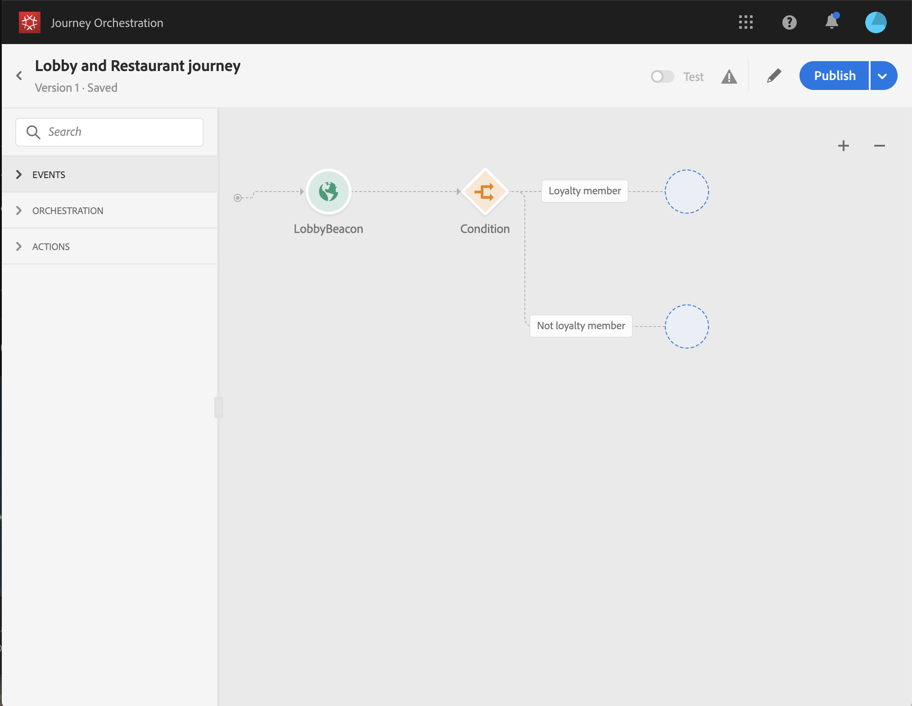
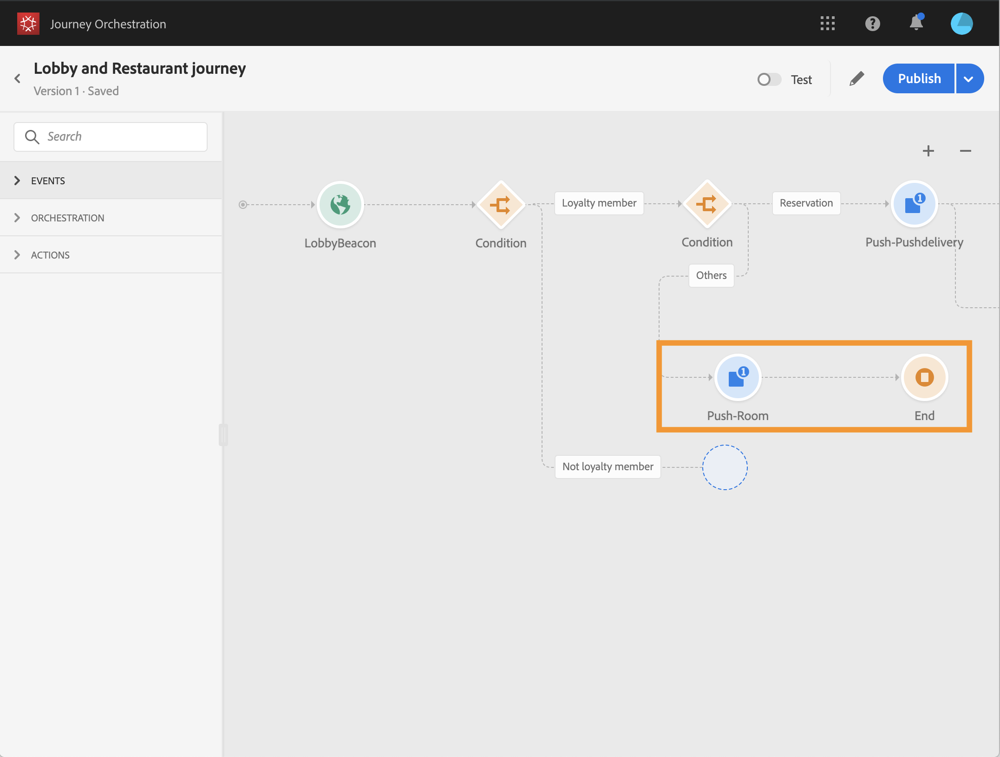
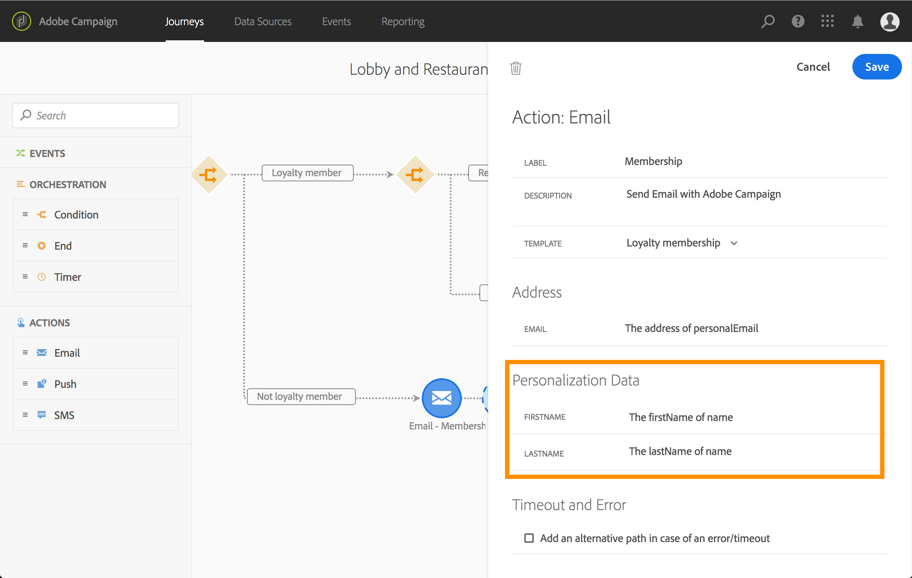

# 旅の構築 {#concept_owm_kdy_w2b}

ビジネ **スユーザーは** 、これで旅行を作成できます。 以下の活動を行います。

* 2つのア **[!UICONTROL Event]**クティビティ：&quot;LobbyBeacon&quot;と&quot;RestarantBeacon&quot;
* 二つの **[!UICONTROL Condition]**活動
* 3つのア **[!UICONTROL Push]**クティビティと1**[!UICONTROL Email]** つのアクティビティ（Adobe Campaign Standardを使用）
* 活 **[!UICONTROL Wait]**動
* 四つの **[!UICONTROL End]**活動

>[!NOTE]
>
>とアク **[!UICONTROL Push]**ティビテ**[!UICONTROL Email]** ィは、Adobe Campaign Standardを使用している場合にのみパレットで使用できます。

旅の作り方に関する詳細は、を参照してください [](../building-journeys/journey.md)。

## 最初の手順{#section_ntb_ws1_ffb}

1. 上部のメニューで、タブをクリック **[!UICONTROL Home]**し、新しい**[!UICONTROL Create]** ジャーニーを作成します。

   

1. 右側に表示される設定ペインで、ジャーニーのプロパティを編集します。 名前を追加し、12月1日から12月31日までの1か月間に設定します。

   

1. 「LobbyBeacon」イベントをパレットからキャンバスにドラッグ&amp;ドロップして、旅のデザインを開始します。 また、パレットでイベントをダブルクリックして、キャンバスに追加することもできます。

   

1. 次に、その人が過去24時間以内に連絡を受けていないことを確認し、忠誠度のメンバーであるかどうかを確認する条件を追加します。 条件アクティビティをドラッグ&amp;ドロップして、旅に出ます。

   

1. タイプを選択 **[!UICONTROL Data Source Condition]**し、フィールド内をクリック**[!UICONTROL Expression]** します。 また、キャンバスの矢印に表示する条件ラベルを定義することもできます。 この例では、「条件1」を「忠誠度メンバー」に置き換えます。

   

1. をクリ **[!UICONTROL Advanced mode]**ックし、Experience Platformデータソースから取得した「timestamp」フィールドと「directMarketing.sends.value」フィールドに基づいて、次の条件を定義します。 式の構文は次のとおりです。

   ```
   count(#{ExperiencePlatformDataSource.MarltonExperience.experienceevent.all(
       currentDataPackField.directMarketing.sends.value > 0 and
       currentDataPackField.timestamp > nowWithDelta(-1, "days")).timestamp}) == 0
   and
       #{ExperiencePlatformDataSource.MarltonProfiles.Profile._customer.marlton.loyaltyMember}
   ```

   

1. ボタンをク **[!UICONTROL Add a path]**リックし、過去24時間に連絡を受けておらず、忠誠度のメンバーでない顧客の2番目のパスを作成します。 パスに「Not loyalty member」という名前を付けます。 式の構文は次のとおりです。

   ```
   count(#{ExperiencePlatformDataSource.MarltonExperience.experienceevent.all(
       currentDataPackField.directMarketing.sends.value > 0 and
       currentDataPackField.timestamp > nowWithDelta(-1, "days").timestamp}) == 0
   and not
       #{ExperiencePlatformDataSource.MarltonProfiles.Profile._customer.marlton.loyaltyMember}
   ```

   >[!NOTE]
   >
   >式の2番目の部分では、「プロファイル」はオプションです。

1. 名前空間を選択する必要があります。 名前空間は、スキーマのプロパティに基づいて事前に選択されています。 事前に選択した状態を維持できます。 名前空間の詳細については、を参照してくださ [](../event/selecting-the-namespace.md)い。

使用例では、この2つの条件に対してのみ反応したいので、チェックボックスはオフにしま **[!UICONTROL Show path for other cases than the one(s) above]**す。

条件の後に2つのパスが作成されます。

* _過去24時間に連絡を受けておらず、忠誠度に関する会員である顧客。_
* _過去24時間に連絡を受けておらず、忠誠度の高い会員でない顧客。_



## 最初のパス：顧客は忠誠度のメンバーです {#section_otb_ws1_ffb}

1. 最初のパスに、予約があるかどうかを確認する条件を追加します。 条件アクティビティをドラッグ&amp;ドロップして、旅に出ます。

   

1. タイプを選 **[!UICONTROL Data Source Condition]**択し、予約システムから取得した予約ステータス情報に基づいて条件を定義します。

   ```
   #{MarltonReservation.MarltonFieldGroup.reservation} == true
   ```

   

1. 外部データソースからフィールドを選択すると、画面の右側に、外部データソースの設定時に定義されたパラメータのリストが表示されます(を参照 [](../usecase/configuring-the-data-sources.md))。 パラメーター名をクリックし、この例では予約システムキーの値であるExperience Cloud IDを定義します。

   ```
   @{LobbyBeacon.endUserIDs._experience.mcid.id}
   ```

   

1. 予約のないお客様にも対応したいので、チェックボックスをオンにする必要があります **[!UICONTROL Show path for other cases than the one(s) above]**。

   

   2つのパスが作成されます。

   * _部屋を予約した顧客_
   * _部屋を予約していない顧客。_
   

1. 最初のパス（予約済みのパス）で、アクティビティをドロッ **[!UICONTROL Push]**プし、モバイルアプリと「ようこそ」テンプレートを選択します。

   

1. プッシュを送 **[!UICONTROL Target]**信するために必要なフィールドを定義します。

   * **[!UICONTROL Push platform]**:プラットフォームの選択：**[!UICONTROL Apple Push Notification Server]** (Apple)または **[!UICONTROL Firebase Cloud Messaging]**(Android)。
   * **[!UICONTROL Registration token]**:アドバンスモードを使用して、（設定済みのイベントに基づいて）次の式を追加します。

      ```
      @{LobbyBeacon._experience.campaign.message.profileSnapshot.pushNotificationTokens.first().token}
      ``
      
1. プッシュ通知パーソナライゼーションフィールドを定義します。 この例では、次のようになります。名と姓

1. 「RestarantBeacon」イベントを追加します。

   

1. 新しいアクティビティ **[!UICONTROL Push]**を追加し、「食事割引」テンプレートを選択して、とのフィー**[!UICONTROL Address]** ルドを定義 **[!UICONTROL Personalization]**します。 アクティビティを追**[!UICONTROL End]** 加します。

   

1. お勧めのプッシュ後6時間以内にレストランに入った場合にのみ、割引プッシュ通知を送信します。 これを行うには、待機アクティビティを使用する必要があります。 カーソルをようこそプッシュアクティビティに置き、「+」記号をクリックします。 新しいパスに、待機アクティビティを追加し、6時間の期間を定義します。 最初の有効なアクティビティが選択されます。 レストランイベントがウェルカムプッシュから6時間未満で受信された場合、プッシュアクティビティが送信されます。 次の6時間以内にレストランのイベントが受け取られない場合は、待機が選択されます。 待機アクティビティ **[!UICONTROL End]**の後にアクティビティを配置します。

   

1. 予約条件に従う2番目のパス（予約済みの部屋がない）に、アクティビティを追加し、「 **[!UICONTROL Push]**部屋料金」テンプレートを選択します。 アクティビティを追**[!UICONTROL End]** 加します。

   

## 2番目のパス：顧客が忠誠度のメンバーではありません{#section_ptb_ws1_ffb}

1. 最初の条件に従う2つ目のパス（顧客が忠誠度メンバーではない）で、アクティビティを追加し、「忠誠度メン **[!UICONTROL Email]**バーシップ」テンプレートを選択します。

   

1. フィールド **[!UICONTROL Address]**で、データソースから電子メールアドレスを選択します。

   

1. データソースの姓と名のパーソナライゼーションフィールドを定義します。

   

1. アクティビティを追 **[!UICONTROL End]**加します。

切り替えボタンをク **[!UICONTROL Test]**リックして、旅行をテストします。 エラーが発生した場合は、テストモードを非アクティブ化し、ジャーニーを変更して、もう一度テストします。 For more information on the test mode, refer to[](../building-journeys/testing-the-journey.md).


テストが決定的な場合は、右上のドロップダウンメニューからジャーニーを公開できます。


