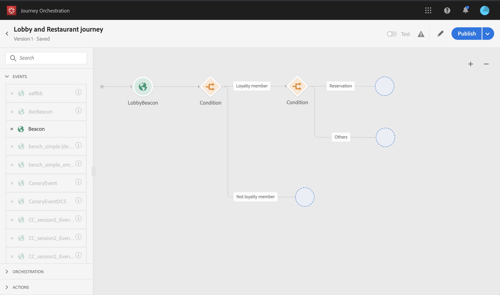

# ジャーニーの構築 {#concept_owm_kdy_w2b}

**ビジネスユーザー**&#x200B;はジャーニーを構築できるようになります。ジャーニーには以下のアクティビティが含まれます。

* 2 つの&#x200B;**[!UICONTROL イベント]**&#x200B;アクティビティ：「LobbyBeacon」および「RestaurantBeacon」
* 2 つの&#x200B;**[!UICONTROL 条件]**&#x200B;アクティビティ
* 3 つの&#x200B;**[!UICONTROL プッシュ]**&#x200B;アクティビティと 1 つの **[!UICONTROL E メール]**&#x200B;アクティビティ（Adobe Campaign Standard を使用）
* **[!UICONTROL 待機]**&#x200B;アクティビティ
* 4 つの&#x200B;**[!UICONTROL エンド]**&#x200B;アクティビティ

>[!NOTE]
>
>**[!UICONTROL プッシュ]**&#x200B;アクティビティと **[!UICONTROL E メール]**&#x200B;アクティビティは、Adobe Campaign Standard がある場合にのみパレットで使用できます。

For additional information on how to build a journey, refer to [this page](../building-journeys/journey.md).

## 最初の手順{#section_ntb_ws1_ffb}

1. 上部のメニューで、「**[!UICONTROL ホーム]**」タブをクリックし、「**[!UICONTROL 作成]**」をクリックして新しいジャーニーを作成します。

   

1. 右側に表示される設定ペインで、ジャーニーのプロパティを編集します。名前を付け、12 月 1 日から 12 月 31 日まで、1 か月間継続するように設定します。

   

1. パレットから「LobbyBeacon」イベントをキャンバスにドラッグ&amp;ドロップして、ジャーニーのデザインを開始します。パレット内のイベントをダブルクリックしてキャンバスに追加することもできます。

   

1. ここで、その人が過去 24 時間以内に連絡を受けていないことを確認する条件を追加し、その人がロイヤルティメンバーかどうかも確認します。ジャーニーに条件アクティビティをドラッグ＆ドロップします。

   

1. 「**[!UICONTROL データソースの条件]**」タイプを選択し、「**[!UICONTROL 式]**」フィールドをクリックします。また、キャンバス上の矢印に表示される「条件」ラベルを定義することもできます。この例では、「条件 1」を「ロイヤルティメンバー」に置き換えます。

   

1. 「**[!UICONTROL 詳細設定モード]**」をクリックし、Adobe Experience Platform データソースから取得した「timestamp」フィールドと「directMarketing.sends.value」フィールドに基づいて、次の条件を定義します。式の構文は次のとおりです。

   ```
   count(#{ExperiencePlatformDataSource.MarltonExperience.experienceevent.all(
       currentDataPackField.directMarketing.sends.value > 0 and
       currentDataPackField.timestamp > nowWithDelta(-1, "days")).timestamp}) == 0
   and
       #{ExperiencePlatformDataSource.MarltonProfiles.Profile._customer.marlton.loyaltyMember}
   ```

   

1. 「**[!UICONTROL パスを追加]**」ボタンをクリックし、過去 24 時間以内に連絡を受けておらず、ロイヤルティメンバーではない顧客の 2 番目のパスを作成します。パスに「非ロイヤルティメンバー」という名前を付けます。式の構文は次のとおりです。

   ```
   count(#{ExperiencePlatformDataSource.MarltonExperience.experienceevent.all(
       currentDataPackField.directMarketing.sends.value > 0 and
       currentDataPackField.timestamp > nowWithDelta(-1, "days").timestamp}) == 0
   and not
       #{ExperiencePlatformDataSource.MarltonProfiles.Profile._customer.marlton.loyaltyMember}
   ```

   >[!NOTE]
   >
   >式の 2 番目の部分では、「プロファイル」はオプションです。

1. 名前空間を選択する必要があります。名前空間は、スキーマのプロパティに基づいて事前に選択されます。あらかじめ選択されているものを、選択したままにすることができます。For more information on namespaces, see [this page](../event/selecting-the-namespace.md).

このユースケースでは、この 2 つの条件にのみ反応したいので、「**[!UICONTROL 上記以外の他の事例のパスを表示]**」チェックボックスはオフにします。

条件の後に 2 つのパスが作成されます。

* _過去 24 時間に連絡を受けていない、ロイヤルティメンバーの顧客。_
* _過去 24 時間に連絡を受けていない、ロイヤルティメンバーではない顧客。_


## 最初のパス：ロイヤルティメンバーの顧客{#section_otb_ws1_ffb}

1. 最初のパスに、予約があるかどうかを確認する条件を追加します。ジャーニーに条件アクティビティをドラッグ＆ドロップします。

   

1. 「**[!UICONTROL データソースの条件]**」タイプを選択し、予約システムから取得した予約ステータス情報に基づいて条件を定義します。

   ```
   #{MarltonReservation.MarltonFieldGroup.reservation} == true
   ```

   

1. When you select a field from an external data source, the right part of the screen displays the list of parameters that were defined when configuring the external data source (see [this page](../usecase/configuring-the-data-sources.md)). パラメーター名をクリックし、予約システムキーの値（この例では Experience Cloud ID）を定義します。

   ```
   @{LobbyBeacon.endUserIDs._experience.mcid.id}
   ```

   

1. また、予約をしていない顧客にも反応したいので、「**[!UICONTROL 上記以外の他の事例のパスを表示]**」チェックボックスをオンにする必要があります。

   

   次の 2 つのパスが作成されます。

   * _部屋を予約してある顧客_
   * _部屋を予約していない顧客_

   

1. 最初のパス（部屋を予約済み）に、**[!UICONTROL プッシュ]**&#x200B;アクティビティをドロップし、モバイルアプリと「ウェルカム」テンプレートを選択します。

   

1. プッシュを送信するためにシステムで必要な「**[!UICONTROL ターゲット]**」フィールドを定義します。

   * **[!UICONTROL プッシュプラットフォーム]**：**[!UICONTROL Apple Push Notification Server]**（Apple）または **[!UICONTROL Firebase Cloud Messaging]**（Android）、いずれかのプラットフォームを選択します。
   * **[!UICONTROL 登録トークン]**：詳細設定モードを使用して、（設定済みのイベントに基づいて）次の式を追加します。

      ```
      @{LobbyBeacon._experience.campaign.message.profileSnapshot.pushNotificationTokens.first().token}
      ```

1. プッシュ通知パーソナライゼーションフィールドを定義します。この例では、姓と名です。

1. 「RestaurantBeacon」イベントを追加します。

   

1. 新しい&#x200B;**[!UICONTROL プッシュ]**&#x200B;アクティビティを追加して、「食事割引」テンプレートを選択し、「**[!UICONTROL アドレス]**」フィールドと「**[!UICONTROL パーソナライゼーション]**」フィールドを定義します。**[!UICONTROL 終了]**&#x200B;アクティビティを追加します。

   

1. 「ウェルカム」プッシュから 6 時間以内にレストランに入った場合にのみ「食事割引」プッシュ通知を送信します。これをおこなうには、待機アクティビティを使用する必要があります。「ウェルカム」プッシュアクティビティにカーソルを置き、「+」記号をクリックします。新しいパスに待機アクティビティを追加し、期間を 6 時間に定義します。最初の有効なアクティビティが選択されます。「ウェルカム」プッシュから 6 時間未満にレストランのイベントが受信された場合は、プッシュアクティビティが送信されます。さらに次の 6 時間以内にレストランのイベントが受信されない場合は、待機が選択されます。待機アクティビティの後に、**[!UICONTROL 終了]**&#x200B;アクティビティを配置します。

   

1. 予約条件に従う 2 番目のパス（部屋を予約していない）に、**[!UICONTROL プッシュ]**&#x200B;アクティビティを追加し、「客室レート」テンプレートを選択します。**[!UICONTROL 終了]**&#x200B;アクティビティを追加します。

   

## 2 番目のパス：ロイヤルティメンバーではない顧客{#section_ptb_ws1_ffb}

1. 最初の条件に従う 2 番目のパス（顧客がロイヤルティメンバーではない）で、**[!UICONTROL E メール]**&#x200B;アクティビティを追加し、「ロイヤルティメンバーシップ」テンプレートを選択します。

   

1. 「**[!UICONTROL アドレス]**」フィールドで、データソースからメールアドレスを選択します。

   

1. データソースの姓と名のパーソナライゼーションフィールドを定義します。

   

1. **[!UICONTROL 終了]**&#x200B;アクティビティを追加します。

「**[!UICONTROL テスト]**」トグルをクリックして、ジャーニーをテストします。エラーが発生した場合は、テストモードを非アクティブ化し、ジャーニーを変更して再度テストします。For more information on the test mode, refer to [this page](../building-journeys/testing-the-journey.md).


テストの最終的な結果が得られたら、右上のドロップダウンメニューからジャーニーを公開できます。


