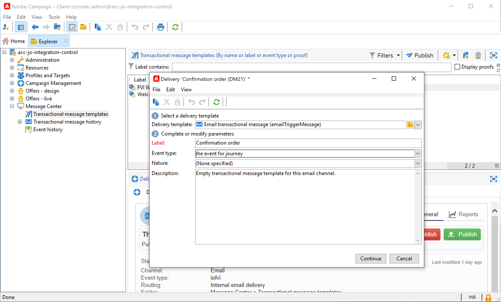
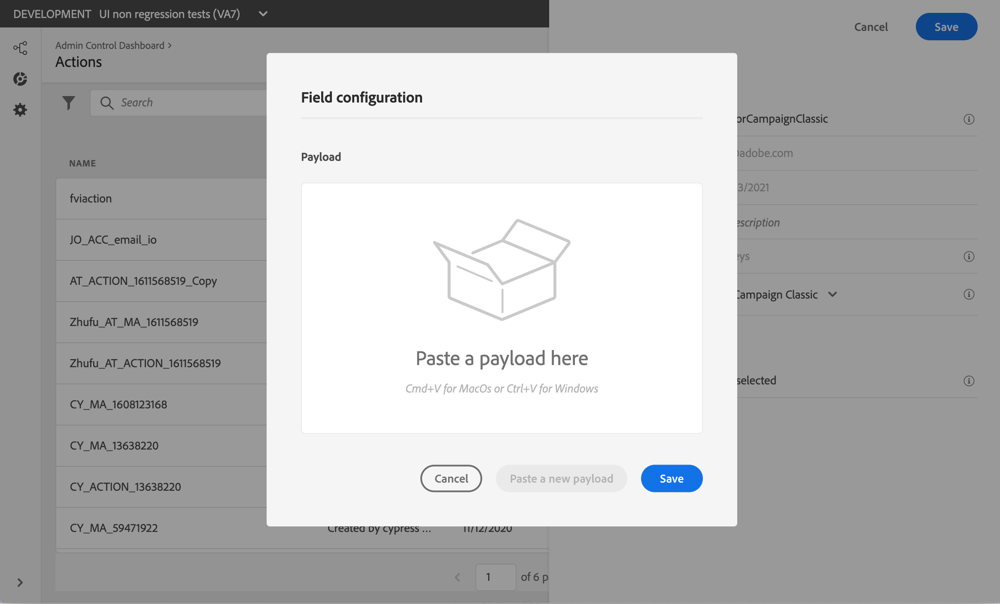

# Campaign v7／v8 を使用したメッセージの送信 {#campaign-classic-use-case}

この使用例では、Adobe Campaign Classic v7 および Adobe Campaign v8 との統合を使用して電子メールを送信するために必要なすべての手順を示します。

まず、Campaign でトランザクションメールテンプレートを作成します。次に、Journey Orchestration で、イベントとアクションを作成し、ジャーニーをデザインします。

Campaign の統合について詳しくは、次のページを参照してください。

* [Campaign アクションの作成](../action/acc-action.md)
* [ジャーニーでのアクションの使用](../building-journeys/using-adobe-campaign-classic.md)。

**Adobe Campaign**

Campaign インスタンスをこの統合用にプロビジョニングする必要があります。トランザクションメッセージ機能を設定する必要があります。

1. Campaign コントロールインスタンスにログインします。

1. **管理**／**プラットフォーム**／**列挙**&#x200B;で、**イベントタイプ**（eventType）列挙を選択します。 新しいイベントタイプ（この例では「journey-event」）を作成します。 後で JSON ファイルを書き込む際には、イベントタイプの内部名を使用する必要があります。

   

1. 作成を有効にするには、インスタンスを切断して、再接続します。

1. **Message Center**／**トランザクションメッセージテンプレート**&#x200B;で、以前に作成したイベントタイプに基づいて新しいメールテンプレートを作成します。

   

1. テンプレートをデザインします。この例では、プロファイルの名と注文番号にパーソナライゼーションを使用します。名前は Adobe Experience Platform データソースにあり、注文番号は Journey Orchestration イベントのフィールドにあります。 Campaign で正しいフィールド名を使用していることを確認します。

   

1. トランザクションテンプレートを公開します。

   

1. 次に、テンプレートに対応する JSON ペイロードを記述する必要があります。

```
{
     "channel": "email",
     "eventType": "journey-event",
     "email": "Email address",
     "ctx": {
          "firstName": "First name", "purchaseOrderNumber": "Purchase order number"
     }
}
```

* チャネルには、「email」と入力する必要があります。
* eventType には、以前に作成したイベントタイプの内部名を使用します。
* メールアドレスは変数なので、任意のラベルを入力できます。
* ctx では、パーソナライゼーションフィールドも変数です。

**Journey Orchestration**

1. まず、イベントを作成する必要があります。「purchaseOrderNumber」フィールドを必ず含めてください。

   

1. Journey Orchestration で、キャンペーンテンプレートに対応するアクションを作成します。 「**アクションタイプ**」ドロップダウンで、**Adobe Campaign Classic** を選択します。

   

1. 「**ペイロードフィールド**」をクリックし、以前に作成した JSON を貼り付けます。

   

1. メールアドレスと 2 つのパーソナライゼーションフィールドで、「**定数**」を「**変数**」に変更します。

   

1. 次に、新しいジャーニーを作成し、以前に作成したイベントから開始します。

   

1. アクションを追加し、各フィールドを Journey Orchestration の正しいフィールドにマッピングします。

   

1. **終了**&#x200B;アクティビティを追加し、ジャーニーをテストします。

   

1. これで、ジャーニーを公開できます。
