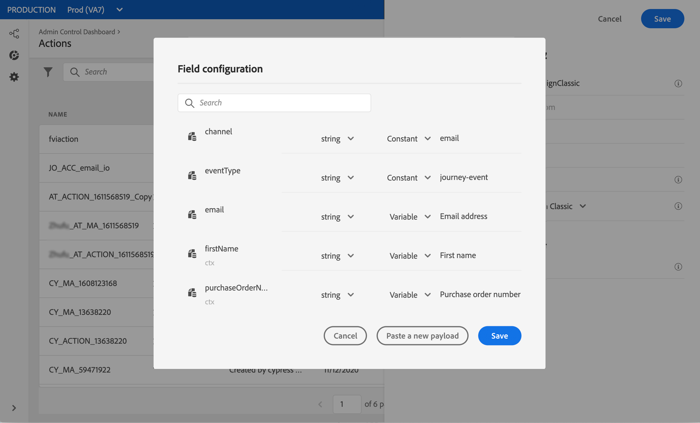

# キャンペーン{#campaign-v7-v8-use-case}を使用したメッセージの送信

この使用例では、Adobe Campaign統合を使用してEメールを送信するために必要なすべての手順を示します。

まず、CampaignでトランザクションEメールテンプレートを作成します。 次に、Journey Orchestrationで、イベント、アクションを作成し、ジャーニーを設計します。

Campaignの統合について詳しくは、次のページを参照してください。

* [キャンペーンアクションの作成](../action/working-with-adobe-campaign.md#using_adobe_campaign_v7_v8)
* [ジャーニーでのアクションの使用](../building-journeys/using-adobe-campaign-actions.md)を参照してください。

**Adobe Campaign**

この統合のために、Campaignインスタンスをプロビジョニングする必要があります。 トランザクションメッセージ機能を設定する必要があります。

1. Campaignコントロールインスタンスにログインします。

1. **管理** > **プラットフォーム** > **列挙**&#x200B;で、**イベントタイプ** (eventType)列挙を選択します。 新しいイベントタイプ（この例では「journey-event」）を作成します。 後でJSONファイルを書き込む際には、イベントタイプの内部名を使用する必要があります。

   

1. 作成を有効にするために、インスタンスを切断し、再接続します。

1. **Message Center** > **トランザクションメッセージテンプレート**&#x200B;の下に、以前に作成したイベントタイプに基づいて新しいEメールテンプレートを作成します。

   

1. テンプレートをデザインします。 この例では、プロファイルの名と注文番号にパーソナライゼーションを使用します。 名はAdobe Experience Platformデータソースに含まれ、注文番号はJourney Orchestrationイベントのフィールドになります。 Campaignで正しいフィールド名を使用していることを確認します。

   

1. トランザクションテンプレートを公開します。

   

1. 次に、テンプレートに対応するJSONペイロードを記述する必要があります。

```
{
     "channel": "email",
     "eventType": "journey-event",
     "email": "Email address",
     "ctx": {
          "firstName": "First name", "purchaseOrderNumber": "Purchase order number"
     }
}
```

* チャネルの場合は、「email」と入力する必要があります。
* eventTypeには、前に作成したイベントタイプの内部名を使用します。
* 電子メールアドレスは変数なので、任意のラベルを入力できます。
* ctxでは、パーソナライゼーションフィールドも変数です。

**Journey Orchestration**

1. 最初に、イベントを作成する必要があります。 「purchaseOrderNumber」フィールドを必ず含めてください。

   

1. 次に、キャンペーンテンプレートに対応するJourney Orchestrationを作成する必要があります。 **アクションタイプ**&#x200B;ドロップダウンで、「**Adobe Campaign Classic**」を選択します。

   

1. 「**ペイロードフィールド**」をクリックし、前に作成したJSONを貼り付けます。

   

1. Eメールアドレスと2つのパーソナライゼーションフィールドに対して、**定数**&#x200B;を&#x200B;**変数**&#x200B;に変更します。

   

1. 次に、新しいジャーニーを作成し、以前に作成したイベントから開始します。

   

1. 「 」アクションを追加し、「 」Journey Orchestrationで各フィールドを正しいフィールドにマッピングします。

   

1. **終了**&#x200B;アクティビティを追加し、ジャーニーをテストします。

   

1. これで、ジャーニーを公開できます。
