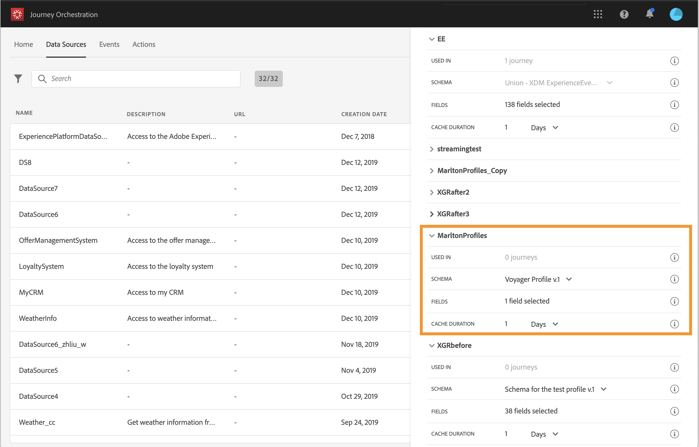
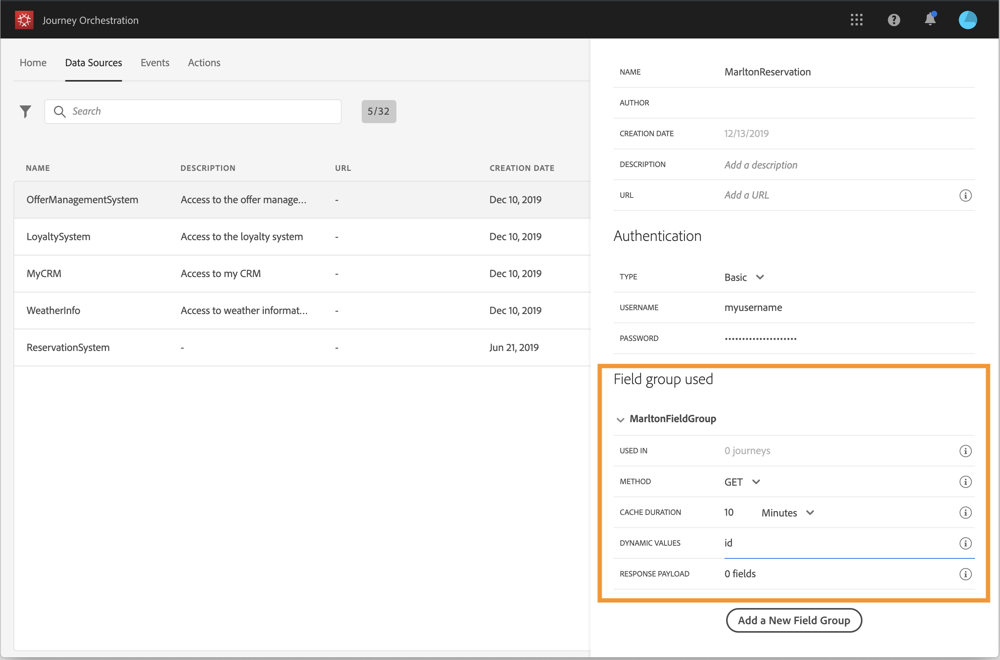

# データソースの設定 {#concept_vml_hdy_w2b}

このユースケースでは、メッセージにパーソナライゼーションデータを使用します。また、そのユーザーがロイヤリティメンバーで、過去 24 時間に連絡されたかどうかも確認する必要があります。この情報は、リアルタイム顧客プロファイルデータベースに保存されています。**技術ユーザー**&#x200B;は、Adobe Experience Platform のデータソースを設定してこれらのフィールドを取得する必要があります。

データソースの設定について詳しくは、[このページ](../datasource/about-data-sources.md)を参照してください。

1. 上部のメニューで、「**[!UICONTROL データソース]**」タブをクリックし、組み込みの Adobe Experience Platform データソースを選択します。

   

1. 事前設定済みのグループフィールドで、次のフィールドが選択されていることを確認します。

   * _person > name > firstName_
   * _person > name > lastName_
   * _personalEmail > address_

1. 「**[!UICONTROL 新しいフィールドグループを追加]**」をクリックし、「**[!UICONTROL プロファイル]**」スキーマを選択して、条件に「**ロイヤリティメンバー**」フィールドを追加します。「**ロイヤリティメンバー**」フィールド（_customer／marlton／loyaltyMember）はカスタムフィールドで、XDM に追加されました。

   

1. 「**[!UICONTROL 新しいフィールドグループを追加]**」をクリックして **[!UICONTROL ExperienceEvent]** スキーマを選択し、指定した期間に送信されるメッセージの数に関する条件に応じて必要なフィールドを選択します（日付は「_タイムスタンプ_」、送信されたメッセージ数は _directMarketing／送信／値_）。

   

1. 「**[!UICONTROL 保存]**」をクリックします。

ホテルの予約システムに予約があるかどうかも確認する必要があります。**技術ユーザー**&#x200B;は、このフィールドを取得するために 2 つ目のデータソースを設定する必要があります。

1. データソースのリストで、「**[!UICONTROL 追加]**」をクリックして新しい外部データソースを追加し、ホテル予約システムへの接続を定義します。

   

1. データソースの名前と外部サービスの URL を入力します（例：_https://marlton.com/reservation_）。

   >[!CAUTION]
   >
   >セキュリティ上の理由から、HTTPS の使用を強くお勧めします。

1. 外部サービスの設定に応じて認証を&#x200B;**[!UICONTROL 認証なし]**、**[!UICONTROL 基本]**、**[!UICONTROL カスタム]**、**[!UICONTROL API キー]**&#x200B;のいずれかに設定します。この例では、タイプに「基本」を選択し、API 呼び出しのユーザー名とパスワードを指定します。

   

1. 「**[!UICONTROL 新しいフィールドグループを追加]**」をクリックして、取得する情報と API パラメーターを定義します。この例では、パラメーター（ID）は 1 つだけなので、次の情報を含む 1 つのフィールドグループを作成する必要があります。

   * **[!UICONTROL メソッド]**：POST または GET メソッドを選択します。ここでは GET メソッドを選択します。
   * **[!UICONTROL キャッシュ時間]**：これは、API 呼び出しの頻度に応じて変わります。ここでは、予約システムは 10 分ごとにアップデートされます。
   * **[!UICONTROL 応答ペイロード]**：「**[!UICONTROL ペイロード]**」フィールド内をクリックし、ペイロードの例を貼り付けます。フィールドタイプが正しいことを確認します。API が呼び出されるたびに、ペイロードの例に含まれるすべてのフィールドが取得されます。この例では、ペイロードには予約ステータスのみが含まれます。

   ```
   {
       "reservation" : true
   }
   ```

   * **[!UICONTROL 動的な値]**：例では、各顧客の識別に使用するキーに対応するパラメーター（「id」）を入力します。このパラメーターの値は、ジャーニーで定義されます。

   

1. 「**[!UICONTROL 保存]**」をクリックします。

   データソースが設定され、ジャーニーで使用できる状態になります。
