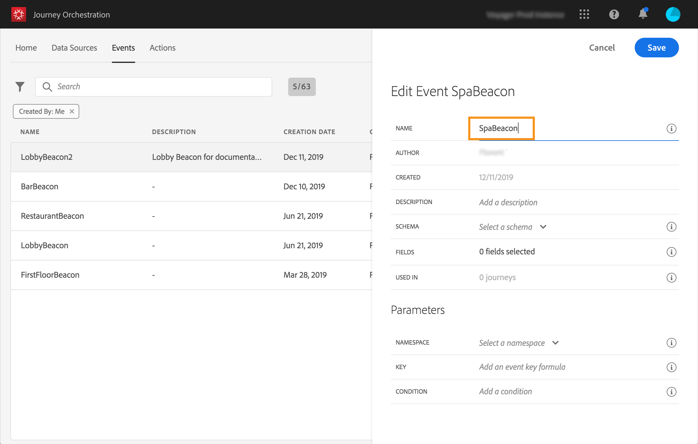

# イベントの設定{#concept_y44_hcy_w2b}

このシナリオでは、ユーザーがスパの隣にあるビーコンの近くを歩くたびに、イベントを受け取る必要があります。**技術ユーザー**&#x200B;は、ジャーニーでシステムがリッスンするイベントを設定する必要があります。

イベントの設定について詳しくは、[このページ](../event/about-events.md)を参照してください。

1. 上部のメニューで、「**[!UICONTROL イベント]**」タブをクリックし、「**[!UICONTROL 追加]**」をクリックして新しいイベントを作成します。

   

1. スペースや特殊文字を使用しない名前を入力します（例：SpaBeacon）。

   

1. 次に、スキーマを選択し、このイベントに必要なペイロードを定義します。必要なフィールドは、XDM 正規化モデルから選択します。リアルタイム顧客プロファイルデータベース内の個人を識別するには、Experience Cloud ID が必要です（_endUserIDs／エクスペリエンス／mcid／id_）。このイベントに対して ID が自動的に生成されます。この ID は、「**[!UICONTROL eventID]**」フィールド（_エクスペリエンス／キャンペーン／オーケストレーション／eventID_）に格納されます。イベントをプッシュするシステムでは ID を生成せずに、ペイロードプレビューにある ID を使用する必要があります。このユースケースでは、この ID を使用してビーコンの場所を識別します。ユーザーがスパビーコンの近くを歩くたびに、この特定のイベント ID を含むイベントが送信されます。これにより、イベント送信をトリガーしたビーコンを特定できます。

   

   >[!NOTE]
   >
   >フィールドのリストは、スキーマによって異なります。スキーマ定義によって、一部のフィールドが必須で、事前に選択されている場合があります。

1. 名前空間を選択する必要があります。名前空間は、スキーマのプロパティに基づいて事前に選択されます。あらかじめ選択されているものを、選択したままにすることができます。名前空間の詳細については、[このページ](../event/selecting-the-namespace.md)を参照してください。

   

1. キーは、スキーマのプロパティと選択された名前空間に基づいて事前に選択されます。そのままでよいです。

   

1. 「**[!UICONTROL 保存]**」をクリックします。

1. **[!UICONTROL ペイロードを表示]**&#x200B;アイコンをクリックして、イベントが予想するペイロードをプレビューし、ペイロード送信の担当者と共有します。このペイロードは、Mobile Services 管理コンソールのポストバックで設定する必要があります。

   

   イベントは、ジャーニーで使用できる状態になっています。次に、期待されたペイロードをストリーミング取得 API エンドポイントに送信できるように、モバイルアプリケーションを設定する必要があります。[このページ](../event/additional-steps-to-send-events-to-journey-orchestration.md)を参照してください。