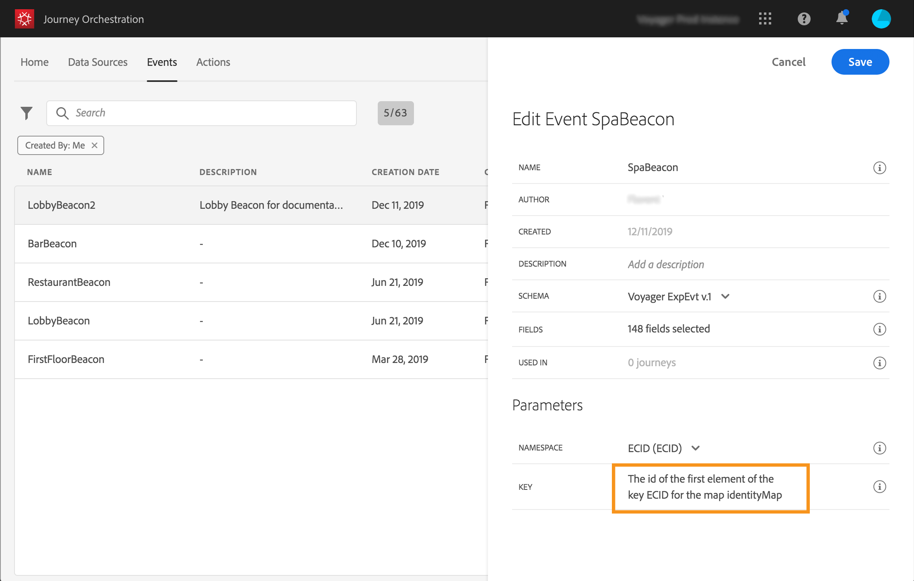

# イベントの設定{#concept_y44_hcy_w2b}

このシナリオでは、人がスパの隣にあるビーコンの近くを歩くたびに、イベントを受け取る必要があります。 技術ユ **ーザーは** 、システムがアドビの遍歴でリッスンするイベントを設定する必要があります。

イベントの設定の詳細については、を参照してくださ い。

1. 上部のメニューで、タブをクリックし、 **[!UICONTROL Events]**をクリックして新し**[!UICONTROL Add]** いイベントを作成します。

   

1. スペースや特殊文字を含まない名前を入力します。「SpaBeacon」。

   

   <!--li>Select the **[!UICONTROL Mobile - Streaming Ingestion APIs]** event type. Events are sent from the customers' mobile phone through the Mobile SDK.。 イベントをプッシュするシステムではIDを生成しないでください。ペイロードプレビューで使用できるIDを使用する必要があります。 使用事例では、このIDを使用してビーコンの場所を識別します。 訪問者がスパビーコンの近くを歩くたびに、この特定のイベントIDを含むイベントが送信されます。 これにより、イベント送信をトリガーしたビーコンをシステムが知ることができます。

   

   >[!NOTE]
   >
   >フィールドのリストはスキーマによって異なります。 スキーマ定義によっては、一部のフィールドが必須であり、事前に選択されている場合があります。

1. 名前空間を選択する必要があります。 名前空間は、スキーマのプロパティに基づいて事前に選択されています。 事前に選択した状態を維持できます。 名前空間の詳細については、を参照してくださ い。

   

1. キーは、スキーマのプロパティと選択した名前空間に基づいて事前に選択されます。 それを持っていい。

   

1. クリック **[!UICONTROL Save]**.

1. アイコンをク **[!UICONTROL View Payload]**リックして、システムが予期するペイロードをプレビューし、イベント送信の責任者と共有します。 このペイロードは、Mobile Services管理コンソールのポストバックで設定する必要があります。

   

   このイベントを旅に出す準備が整いました。 これで、モバイルアプリケーションがStreaming Ingestion APIエンドポイントに必要なペイロードを送信できるように設定する必要があります。 を参照してください。