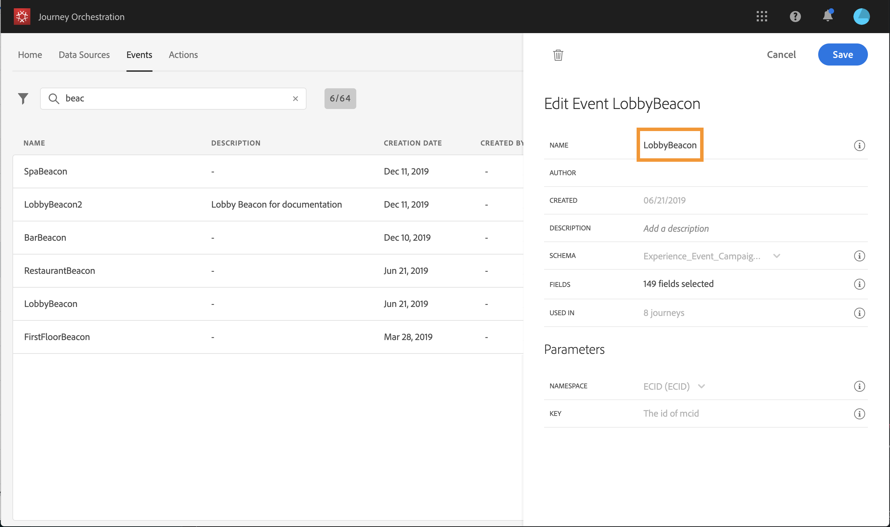

# イベントの設定 {#concept_sbp_5cy_w2b}

私たちのシナリオでは、人がマールトンホテルとレストランに入るたびにイベントを受け取る必要があります。 技術 **ユーザーは** 、システムが遍歴でリッスンする2つのイベントを設定する必要があります。

イベントの設定の詳細については、を参照してくださ い。

1. 上部のメニューで、タブをクリックし、 **[!UICONTROL Events]**をクリックして新し**[!UICONTROL Add]** いイベントを作成します。

   

1. スペースや特殊文字を使用せずに名前を入力します。&quot;LobbyBeacon&quot;。

   

<!--li>Select the **[!UICONTROL Mobile - Streaming Ingestion APIs]** event type. Events are sent from the customers' mobile phone through the Mobile SDK.に保存されます。 イベントをプッシュするシステムではIDを生成しないでください。ペイロードプレビューで使用できるIDを使用する必要があります。 使用事例では、このIDを使用してビーコンの場所を識別します。 人がロビービーコンの近くを歩くたびに、この特定のイベントIDを含むイベントが送信されます。 同じ原則がレストランのビーコンイベントにも当てはまります。 これにより、イベント送信をトリガーしたビーコンをシステムが知ることができます。

   

   >[!NOTE]
   >
   >フィールドのリストはスキーマによって異なります。 スキーマ定義によっては、一部のフィールドが必須であり、事前に選択されている場合があります。

1. 名前空間を選択する必要があります。 名前空間は、スキーマのプロパティに基づいて事前に選択されています。 事前に選択した状態を維持できます。 名前空間の詳細については、を参照してくださ い。

   

1. キーは、スキーマのプロパティと選択した名前空間に基づいて事前に選択されます。 それを持っていい。

   

1. クリック **[!UICONTROL Save]**.

1. アイコンをク **[!UICONTROL View Payload]**リックして、システムが予期するペイロードをプレビューし、イベント送信の責任者と共有します。  このペイロードは、Mobile Services管理コンソールのポストバックで設定する必要があります。

   

同様に、「RestarantBeacon」イベントを作成します。 2つのビーコンイベントが作成され、これでアドビの旅行に使用できます。 これで、モバイルアプリケーションがStreaming Ingestion APIエンドポイントに必要なペイロードを送信できるように設定する必要があります。 を参照してください。
