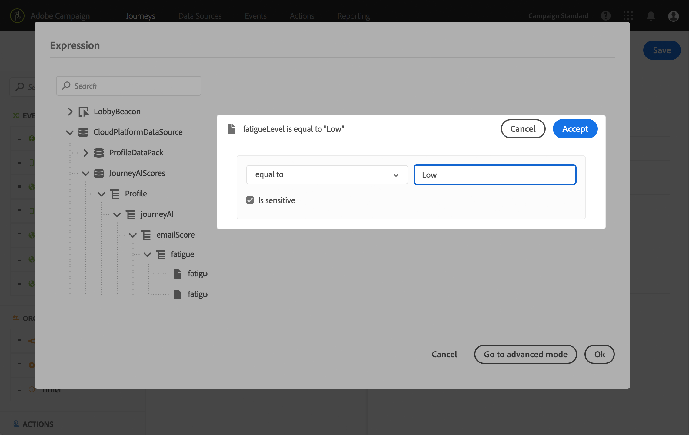

# ジャーニーAIの活用 {#concept_dsh_1ry_wfb}

この使用例では、疲労スコアを活用して、旅行中に顧客に過度の勧誘をしないようにする方法を示します。

>[!NOTE]
>
>予測疲労スコア機能は、Adobe Campaign Standardデータサービス機能を使用するお客様のみ利用できます。

## イベントの設定 {#section_ptb_ws1_ffb}

に示す手順に従い [](../event/about-events.md)ます。

## データソースの設定 {#section_o3n_4yy_wfb}

次の手順を実行して、組み込みデータソースの疲労スコアフィールドを選択します。

1. 上部のメニューで、「 **[!UICONTROL データソース]** 」タブをクリックし、組み込みAdobe Experience Platformのデータソースを選択します。

   

1. 使用事例に必要なフィールドが選択されていることを確認します。
1. 「 **[!UICONTROL 新しいフィールド]**&#x200B;をクリックし、プロファイル **[!UICONTROL グループモデルを選択して、]** を追加します。 **[!UICONTROL fatigueLevel]** fatigueScore ****__ Fields 19

   

1. 「**[!UICONTROL 保存]**」をクリックします。

## ジャーニーの構築 {#section_uzm_pyy_wfb}

遍歴を作成、検証、公開するには、の手順に従い [](../building-journeys/journey.md)ます。

使用事例では、 **[!UICONTROL fatigueLevel]** フィールドを活用しています。 fatigueScore **** フィールドを使用することもできます。

次の手順を実行して、旅程で疲労レベルを活用します。

1. イベント追加と条件を持っています。

   

1. 「 **[!UICONTROL Data Source Condition]** 」タイプを選択し、「 **[!UICONTROL 式]** 」フィールドをクリックします。

   

1. シンプルな式エディターで、 **[!UICONTROL fatigueLevel]** (_ExperiencePlatformDataSource/JeurneryAIScores/プロファイル/jeurneyAI/emailScore/fatigue_)フィールドを探し、右にドロップして、次の条件を作成します。 &quot;fatigueLevel is equal to &quot;Low&quot;. 「**[!UICONTROL OK]**」をクリックします。

   

   詳細式は次のとおりです。

   ```
   #{ExperiencePlatformDataSource.JourneyAIScores.Profile.journeyAI.emailScore.fatigue.fatigueLevel} == "low"
   ```

1. この条件で、中疲労レベルと高疲労レベルを示す2つのパスを作成します。

   

1. 疲労レベルごとに異なるアクションを追加できるようになりました。

   
