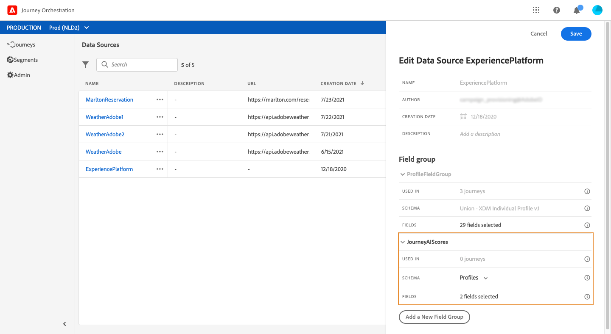

# 疲労スコアの活用 {#concept_dsh_1ry_wfb}

この使用例では、旅行中に顧客に過度の勧誘をしないように疲労スコアを活用する方法を示します。

>[!CAUTION]
>
>予測疲労スコア機能は、Adobe Campaign Standard Data Service機能を使用するお客様のみ利用できます。

## イベントの設定 {#section_ptb_ws1_ffb}

の手順に従います [](../event/about-events.md)。

## データソースの設定 {#section_o3n_4yy_wfb}

組み込みデータソースの疲労スコアフィールドを選択するには、次の手順を実行します。

1. 上部のメニューで、タブをクリック **[!UICONTROL Data Sources]**し、組み込みのExperience Platformデータソースを選択します。

   

1. 使用事例に必要なフィールドが選択されていることを確認します。
1. をクリ **[!UICONTROL Add a New Field Group]**ックし、モデルを選**[!UICONTROL Profiles]** 択して、とフィールド **[!UICONTROL fatigueLevel]**を追加します(**[!UICONTROL fatigueScore]** 「jarenyAI」 > 「emailScore」 > 「fatigue __」の下)。

   

1. クリック **[!UICONTROL Save]**.

## 旅の構築 {#section_uzm_pyy_wfb}

遍歴を作成、検証および公開するには、の手順に従います [](../building-journeys/journey.md)。

使用事例では、この分野を活用してい **[!UICONTROL fatigueLevel]**ます。 このフィールドを使用することもで**[!UICONTROL fatigueScore]** きます。

次の手順を実行して、旅の疲労レベルを活用します。

1. イベントと条件をジャーニーに追加します。

   

1. タイプを選択 **[!UICONTROL Data Source Condition]**し、フィールド内をクリック**[!UICONTROL Expression]** します。

   

1. シンプルな式エディターを使用して、フィールド( **[!UICONTROL fatigueLevel]**_ExperiencePlatformDataSource/JurenyAIScores/Profile/jeurneyAI/emailScore/fatigue_)を探し、右にドロップして、次の条件を作成します。&quot;fatigueLevelは&quot;Low&quot;に等しい。 クリック**[!UICONTROL Ok]**.

   

   高度な式は次のとおりです。

   ```
   #{ExperiencePlatformDataSource.JourneyAIScores.Profile.journeyAI.emailScore.fatigue.fatigueLevel} == "low"
   ```

1. この状態で、中疲労レベルと高疲労レベルを表す2つのパスを作成します。

   

1. 疲労レベルごとに異なるアクションを追加できるようになりました。

   
