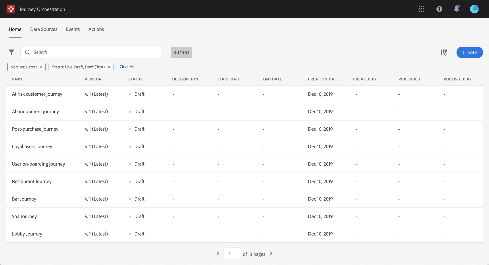
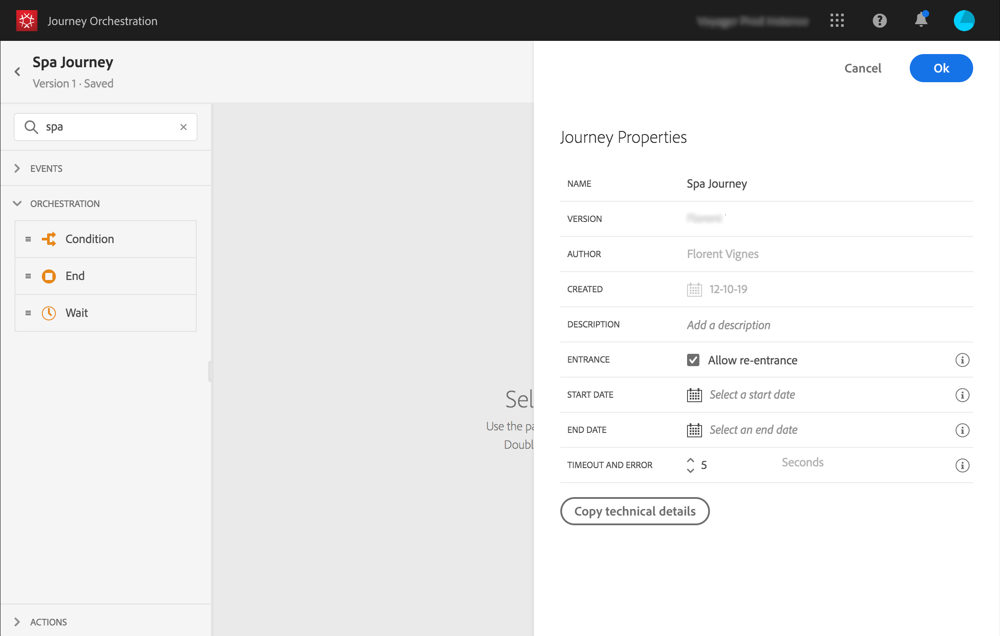
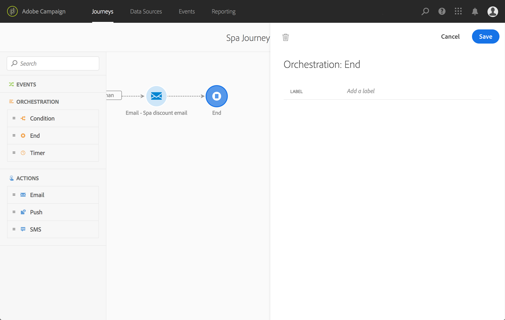

# 旅の構築{#concept_eyw_mcy_w2b}

ビジネ **スユーザーは** 、これで旅行を作成できます。 以下のアクティビティを含むパスは1つだけです。

* 「SpaBeacon」 **[!UICONTROL Event]**:人がスパビーコンの近くを歩くと、システムはイベントを受け取り、その人のために旅を始めます。
* その **[!UICONTROL Condition]**人が女性であることを確認する活動
* アクテ **[!UICONTROL Email]**ィビティ（Adobe Campaign Standardを使用）
* 活 **[!UICONTROL End]**動

>[!NOTE]
>
>とアク **[!UICONTROL Push]**ティビテ**[!UICONTROL Email]** ィは、Adobe Campaign Standardを使用している場合にのみパレットで使用できます。

旅の作り方に関する詳細は、を参照してください 。

1. 上部のメニューで、タブをクリック **[!UICONTROL Home]**し、新しい**[!UICONTROL Create]** ジャーニーを作成します。

   

1. 右側に表示される設定ペインで、ジャーニーのプロパティを編集します。 「スパジャーニー」と名付け、12月1日から31日まで1ヶ月続けます。

   

1. 「SpaBeacon」イベントをパレットからキャンバスにドラッグ&amp;ドロップして、旅のデザインを開始します。 また、パレットでイベントをダブルクリックして、キャンバスに追加することもできます。

   

1. 次に、その人が女性であることを確認する条件を追加します。 条件アクティビティをドラッグ&amp;ドロップして、旅に出ます。

   

1. タイプを選択 **[!UICONTROL Data Source Condition]**し、フィールド内をクリック**[!UICONTROL Expression]** します。 また、キャンバスの矢印に表示する条件ラベルを定義することもできます。

   

1. シンプルな式エディターで、性別フィールド(_人/性別_)を探し、右にドロップして次の条件を作成します。「性別は「女性」と同じです。

   

1. アクティビティを **[!UICONTROL Email]**削除し、「Spa割引」トランザクションメッセージングテンプレートを選択します。 このテンプレートは、Adobe Campaignを使用して設計されています。 この[ページ](https://docs.adobe.com/content/help/en/campaign-standard/using/communication-channels/transactional-messaging/about-transactional-messaging.html)を参照してください。

   

1. フィールド内をクリ **[!UICONTROL Email]**ックし、データソースから電子メールアドレスを選択します。

   

1. 同様に、データソースの姓と名のパーソナライゼーションフィールドを定義します。

   

1. アクティビティを削 **[!UICONTROL End]**除します。

   

1. 切り替えボタンをクリ **[!UICONTROL Test]**ックし、テストプロファイルを使用して遍歴をテストします。 エラーが発生した場合は、テストモードを非アクティブ化し、ジャーニーを変更して、もう一度テストします。 For more information on the test mode, refer to.

   

1. テストが決定的な場合は、右上のドロップダウンメニューからジャーニーを公開できます。

   

次回、女性がスパビーコンの近くを歩くと、「スパディスカウント」のパーソナライズされたメールがすぐに届きます。
