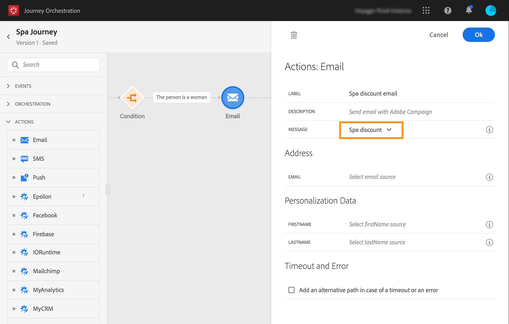

# ジャーニーの構築{#concept_eyw_mcy_w2b}

**ビジネスユーザー**&#x200B;はジャーニーを構築できるようになります。以下のアクティビティを含むパスは1つだけです。

* 「SpaBeacon」 **[!UICONTROL イベント]**:人がspaビーコンの近くを歩くと、イベントが送られ、その人の開始が送られます。
* 人が **[!UICONTROL 女性であるかを調べるアクティビティ]** 。
* 電子 **[!UICONTROL メール]** アクティビティ(Adobe Campaign Standardを使用)
* **[!UICONTROL 終了]**&#x200B;アクティビティ

>[!NOTE]
>
>**[!UICONTROL プッシュ]**&#x200B;アクティビティと **[!UICONTROL E メール]**&#x200B;アクティビティは、Adobe Campaign Standard がある場合にのみパレットで使用できます。

For additional information on how to build a journey, refer to [this page](../building-journeys/journey.md).

1. 上部のメニューで、「**[!UICONTROL ホーム]**」タブをクリックし、「**[!UICONTROL 作成]**」をクリックして新しいジャーニーを作成します。

   

1. 右側に表示される設定ペインで、ジャーニーのプロパティを編集します。12月1日から12月31日まで1か月間「スパジャーニー」と名付けました。

   

1. 「SpaBeacon」イベントをパレットからキャンバスにドラッグ&amp;ドロップして、旅のデザインに開始が発生しました。 パレット内のイベントをダブルクリックしてキャンバスに追加することもできます。

   

1. 次に、その人が女性であることを確認する条件を追加します。 ジャーニーに条件アクティビティをドラッグ＆ドロップします。

   

1. 「**[!UICONTROL データソースの条件]**」タイプを選択し、「**[!UICONTROL 式]**」フィールドをクリックします。また、キャンバス上の矢印に表示される「条件」ラベルを定義することもできます。

   

1. シンプルな式エディターを使用して、性別フィールド(_人/性別_)を探し、右にドロップして次の条件を作成します。「性別は「女性」と同じです。

   

1. 「 **[!UICONTROL 電子メール]** 」アクティビティを削除し、「Spa割引」トランザクションメッセージングテンプレートを選択します。 このテンプレートはAdobe Campaignを使用して設計されています。 この[ページ](https://docs.adobe.com/content/help/ja-JP/campaign-standard/using/communication-channels/transactional-messaging/about-transactional-messaging.html)を参照してください。

   

1. 「 **[!UICONTROL 電子メール]** 」フィールド内をクリックし、データソースから電子メールアドレスを選択します。

   

1. 同様に、データソースの名と姓のパーソナライゼーションフィールドーを定義します。

   

1. Drop an **[!UICONTROL End]** activity.

   

1. Click on the **[!UICONTROL Test]** toggle and test your journey using test profiles. エラーが発生した場合は、テストモードを非アクティブ化し、ジャーニーを変更して再度テストします。For more information on the test mode, refer to [this page](../building-journeys/testing-the-journey.md).

   

1. テストの最終的な結果が得られたら、右上のドロップダウンメニューからジャーニーを公開できます。

   

次回、女性がスパビーコンの近くを歩くと、「スパディスカウント」のパーソナライズされたメールがすぐに届きます。
